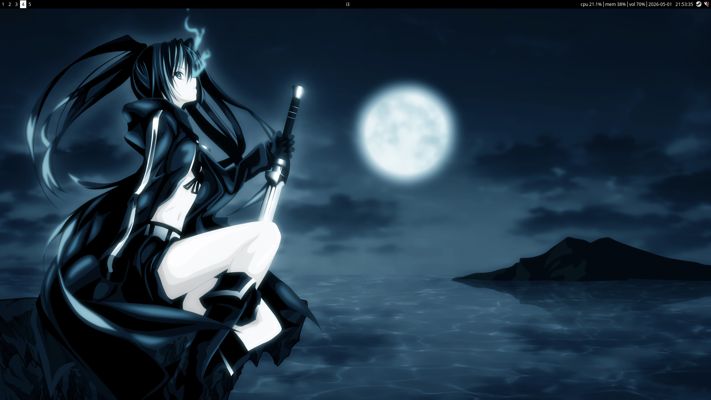
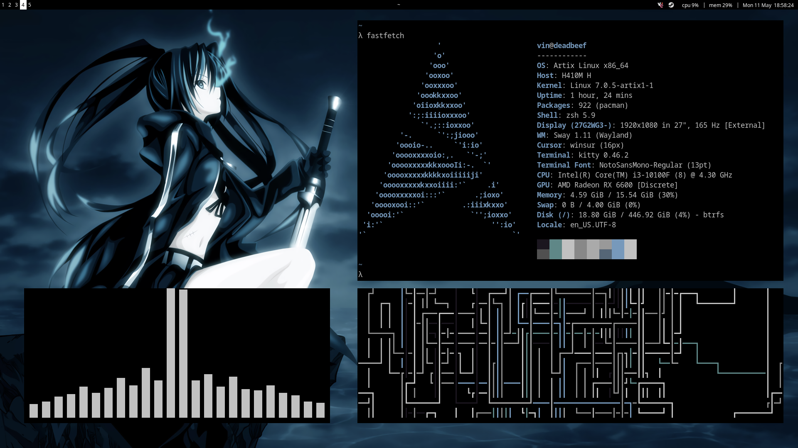
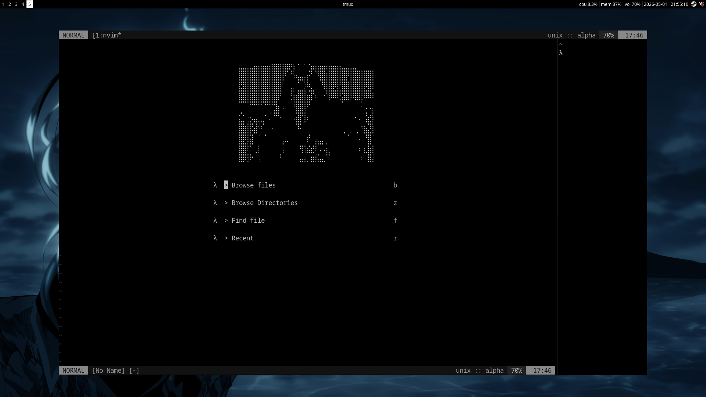

# .config

personal config files for my **artix linux + i3** setup.

this repo exists mostly so i can **restore my desktop after reinstalling** or moving machines.

this was **not made for other users**.
a lot of things here are **very specific to my hardware and workflow** (monitor config, keybinds, etc).

if you copy this blindly and something breaks, that's expected.

if you are new to i3, read the [i3 users guide](https://i3wm.org/docs/userguide.html)

## screenshots

random configs that work on my machine.
use at your own risk.
